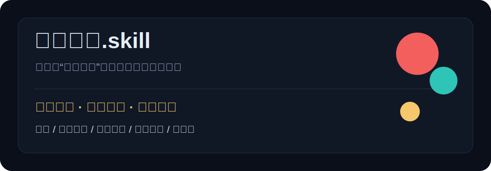

# 一人公司.skill




> 不是帮你想点子，是判断这个点子能不能收钱。

大多数创业建议死在一句话里：先做 MVP。

这个 Skill 从不这样回答。它会把一个想法压回商业现实：谁现在付钱？为什么现在付？竞品怎么收？替代方案是什么？你一个人能不能交付？什么时候该停？

## 先看效果

### `/product` 我想做一个 AI 换装小程序

普通 AI 往往会说：

```text
这个方向不错，可以先验证需求，再优化体验和差异化。
```

一人公司.skill 会先判断：

```text
别先做泛 C 端娱乐换装。真正可能付费的是电商商家：
商品上身图、买家秀替代、详情页素材、小红书种草图、广告测试图。

先卖 99/199/499 元素材服务包：商家给 5 张商品图，你交付 20 张可发布素材。
10 个卖家里没有 3 个付款，就不要继续烧 API。
```

### `/product` 我想做一个给本地门店用的 AI 获客工具

一人公司.skill 会先拆现金流：

```text
不要先卖“AI 获客工具”。门店老板不买工具，买到店、咨询、成交。

先选一个窄行业：口腔、教培、摄影、美甲、家政、装修，本质完全不同。
直接竞品不是 AI，而是美团/抖音团购、代运营、地推、私域运营、老客转介绍。

第一单不要收订阅费。卖“7 天获客试跑”：你交付 20 条可发布内容、3 个落地页标题、
1 套私信话术、1 个成交记录表，收 499/999 元。
如果 10 个门店老板里没有 2 个愿意先付试跑费，就不是产品问题，是支付点不成立。
```

### `/pricing` 我想做一个一人公司案例库

一人公司.skill 会先反驳：

```text
案例本身不值钱，减少错误决策才值钱。

不要先卖“我收集了很多案例”。
先卖“我用相似案例告诉你这个想法哪里会死、第一单怎么收、什么情况下该停”。

第一单可以是：产品判断报告、相似案例诊断、定价获客方案、小额陪跑。
如果用户只收藏案例、不愿为具体判断付费，说明信息焦虑存在，但商业支付点不成立。
```

## 你可能正在问

很多人不是缺一个更长的回答，而是缺一个能马上对号入座的问题入口。

| 你脑子里的想法 | 更适合用哪个入口 | Skill 会先判断什么 |
|---|---|---|
| AI 电商素材、AI 换装、商品图生成 | `/product` | 是卖给消费者玩，还是卖给商家提高上架/投放效率 |
| 本地门店获客、AI 私域、短视频引流 | `/pricing` | 老板愿意为到店、咨询、成交付费，还是只想白嫖工具 |
| 小红书/公众号/短视频选题工具 | `/product` | 用户买的是内容生成，还是账号结果、选题确定性和省时间 |
| 知识产品定价、社群、训练营、手册 | `/pricing` | 承诺边界、交付成本、复购理由和退款风险 |
| 开发者工具、API、转换工具、插件 | `/product` | 是否有明确工作流痛点，免费替代和开源替代有多强 |
| Notion 建站、模板、落地页生成 | `/cases` | 平台依赖、信任成本、备案/访问/交付风险 |
| AI 自动化服务、企业流程自动化 | `/pricing` | 能否产品化成固定结果包，避免滑进无限外包 |
| 案例情报库、行业资料库、导航站 | `/cases` | 用户是否为减少误判付费，而不是只收藏信息 |
| 个人品牌、一人公司咨询、陪跑服务 | `/pricing` | 第一单卖什么结果，怎么避免低价长周期消耗 |
| 功能很多但没人付费 | `/opc` | 删除到一个付费动作，重新找最短成交路径 |

## 怎么用

入口是自然语言命令，不是表单。用户只要输入一句话也能得到判断；缺少关键信息时，Skill 最多先追问 1 个最关键的问题。

```text
/opc 我想做一个 AI 小红书选题工具，帮商家每周找选题、写标题、判断爆款角度。
```

```text
/product 我想做一个 AI 换装小程序，用户输入人物图和商品图就能换衣服。
```

```text
/cases 我想做一个一人公司案例检索库，给做产品前想减少误判的人用。
```

```text
/pricing 我想做一个给本地商家的 AI 获客工具，想知道第一单怎么收、从哪里找用户。
```

把 `skills/one-person-company` 复制到你的 Agent / Codex / ChatGPT-like skills 目录即可使用。

## 推荐安装方式

这个仓库的 Skill 目录是：

```text
skills/one-person-company
```

| 场景 | 操作 | 验证状态 | 注意事项 |
|---|---|---|---|
| Codex GitHub 安装脚本 | 使用 Codex 内置 skill installer，从 `Fangx-AI/one-person-company-skill` 安装 `skills/one-person-company` | 仓库和路径已确认 | 需要本机 Python 可用；安装后重启 Codex |
| 手动安装 | 下载仓库，把 `skills/one-person-company` 复制到你的 skills 目录 | 当前最稳 | 只复制这个目录，不需要复制整个仓库 |
| Cursor / Trae / 其他 Agent | 把 `SKILL.md` 和 `references/` 作为项目规则或知识库导入 | 兼容思路可用 | 不同工具的 skills 目录规范不同，按各自工具配置 |
| 未验证命令 | `npx skills add ...` | 未写入 | 这个仓库目前不把未验证命令写成安装路径 |

安装后直接输入：

```text
/product 我想做一个 AI 换装小程序，用户输入人物图和商品图就能换衣服。
```

## 四个入口

| 入口 | 适合问什么 | 输出重点 |
|---|---|---|
| `/opc` | 我懒得选入口，直接判断这个想法 | 自动选择产品判断、相似案例或定价获客 |
| `/product` | 我这个产品想法能不能做？ | 付费意愿、替代方案、获客难度、交付成本、停损线 |
| `/cases` | 市面上有没有类似产品或路径？ | 相似案例、可复制部分、不可复制风险、下一步验证 |
| `/pricing` | 怎么收费、怎么拿第一批用户？ | 入门价、核心价、高价版、第一单支付路径、首批渠道 |

中文入口 `/产品判断`、`/相似案例`、`/定价获客` 仍然可用，但 GitHub 项目页主推英文入口，方便传播和跨工具使用。

## 它判断什么

一人公司.skill 是一个专门判断“小产品能不能变成生意”的商业作战库。

它默认把每个想法拆成七件事：

- 直接竞品：已经有人在卖什么。
- 相邻替代：用户现在怎么绕过去。
- 免费替代：用户为什么可以不付钱。
- 高价替代：预算已经流向哪里。
- 收费机制：钱因为什么动作发生。
- 交付边界：一个人能不能低成本兑现承诺。
- 停损线：什么信号说明应该暂停、收窄或放弃。

商业化可行性是第一准则。功能、技术、品牌、愿景都要服从一个问题：**这个东西能不能收钱，并且不把一个人拖进无限交付和售后。**

## 为什么不是提示词合集

提示词只能改变表达方式，不能自动带来商业判断。

这个仓库真正沉淀的是三层东西：

- **判断协议**：先判断收费、触达、交付和停损，而不是先讨论功能。
- **案例情报**：用真实案例、替代方案、GitHub 实操信号和内容平台观察校准判断。
- **执行现实**：把备案、支付、微信生态、平台规则、发票、私域、内容分发和售后成本放进同一个判断里。

它的目标不是“让 AI 回答得更像商业顾问”，而是让回答背后有可复用的商业证据和行动路径。

## 证据资产

这个项目的核心资产不是提示词，而是案例情报库。

当前内置：

- 100+ 标准化案例
- 30 条 gold cases
- 39 个案例来源
- 10 个 GitHub 高价值开源知识源
- 16 条 GitHub 实操信号
- 10 个高频市场模式
- 13 个回答质量评估场景
- 13 条金标回答样本
- 10 个可直接阅读的金标问答示例

当前已覆盖的高频市场模式包括：转换工具/API、AI 电商素材/虚拟试衣、AI 小红书内容、开发者工具/API、知识产品、案例情报库、AI 自动化服务、Notion 建站、本地获客、模板与 boilerplate。

案例不是用来装饰回答的。每条资料都要拆成：目标用户、付费机制、获客路径、交付方式、可复制部分、不可复制风险、本土执行现实。

完整示例见 [examples/](examples/)。它们展示同一个问题下，普通 AI 容易怎么泛泛回答，以及一人公司.skill 如何输出商业判断卡。

## 让它变强

这个项目最需要的不是泛泛建议，而是更真实的产品问题、案例和纠错证据。

- 提交产品想法：用 GitHub Issue 写清楚目标用户、现在怎么解决、愿意为什么结果付费、第一单怎么卖。
- 提交案例：补充真实产品、服务、文章、播客、开源项目或内容平台案例，重点写收费方式、获客路径、可复制部分和不可复制风险。
- 纠错：如果某个竞品、价格、渠道、平台规则或执行现实已经过时，直接提交证据链接和建议改法。

## 工作原理

一人公司.skill 默认输出一张商业判断卡：

```text
结论：
付费可能性：
最可能付费的人：
直接竞品：
替代方案：
可收费切口：
第一单动作：
7 天验证：
停损线：
```

背后必须经过这条判断链：

```text
想法
→ 直接竞品
→ 相邻替代
→ 免费替代
→ 高价替代
→ 收费机制
→ 证据边界
→ 一人公司切口
→ 第一单动作
→ 停损线
```

如果找不到强证据，它不会假装确定。它应该说清楚：这个方向目前证据不足，应该先验证哪一个付费触发点。

## 项目结构

```text
skills/
  one-person-company/
    SKILL.md                         # Skill 入口
    references/
      answer-quality.md              # 回答质量标准
      business-judgment.md           # 产品判断和商业可行性
      business-model-delivery.md     # 收费、支付、交付、毛利、复购、停损
      case-intelligence.md           # 案例检索和对照方法
      local-execution.md             # 中文商业语境下的本土执行现实

knowledge/
  cases/                             # 一人公司案例情报库
  github-sources/                    # GitHub 实操信号和开源知识源
  evals/answer-quality/              # 回答质量评估集
  market-patterns/                   # 高频市场模式

examples/                            # 金标问答示例

scripts/opc/                         # 案例校验、导入、检索工具
tests/opc/                           # 仓库边界和知识库质量测试
```

## 本地工具

安装依赖：

```bash
npm install
```

校验仓库：

```bash
npm test
```

匹配相似案例：

```bash
node scripts/opc/match-product-idea.js "我想做一个 AI 小红书选题助手"
```

校验案例库：

```bash
npm run opc:validate:cases:seed
```

校验 GitHub 实操信号：

```bash
npm run opc:validate:github-sources
```

校验示例库：

```bash
npm run opc:validate:examples
```

## 质量门槛

好的回答应该：

- 简洁，但不是空泛。
- 直接，但不是情绪化。
- 可以反驳用户，并给出商业理由。
- 用案例、竞品、替代方案或渠道事实提供信息增量。
- 说明第一单如何支付、交付边界是什么、毛利和售后风险在哪里。
- 拆清楚商业模式：服务、模板、工具、咨询、社群、数据、自动化，不能混在一起讲。
- 明确今天能做的验证动作，以及停损线。

坏回答通常长这样：

- 建议用户先做 MVP，但没有说卖给谁。
- 建议持续输出，但没有渠道、内容角度和成交路径。
- 说市场很大，但没有现有付费机制。
- 只分析功能，不分析获客和交付成本。

## 背后的判断

一人公司不缺点子，缺的是把点子变成收费路径的能力。

所以这个项目不追求“回答更像咨询公司”，而是追求：一个人看完以后，能立刻知道今天该找谁、卖什么、收多少钱、做到什么结果就停。

## 路线图

- [x] 清理旧站点，转为纯 Skill 仓库
- [x] 建立一人公司核心 Skill
- [x] 建立案例库和相似案例检索
- [x] 建立 GitHub 实操信号库
- [x] 增加商业模式与交付 reference
- [x] 重写 GitHub 项目主页
- [x] 补 10 个高频市场模式
- [x] 补 13 条金标回答样本
- [x] 增加 10 个可阅读金标问答示例
- [ ] 持续扩充高质量示例回答
- [ ] 扩充更多一人公司案例
- [ ] 增加普通大模型 vs 本 Skill 的回答对比
- [ ] 做第一轮真实用户内测

## License

MIT License. See [LICENSE](LICENSE).
